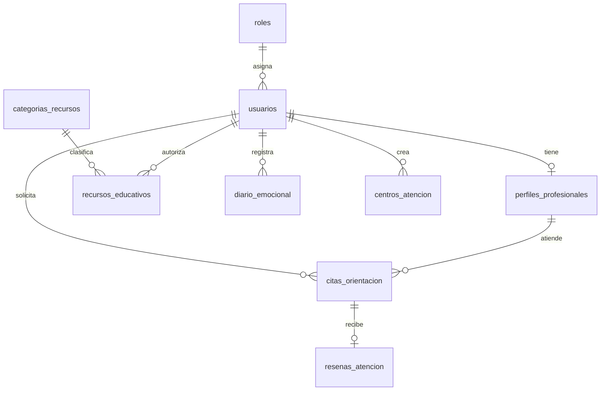

# quackroom

API REST para orientacion emocional, citas con profesionales, recursos educativos y centros de apoyo.

Este repositorio contiene el backend. El SQL incluido es una semilla de desarrollo y no debe ejecutarse sobre una base con datos que se quieran conservar.

## tecnologias

- Node.js, TypeScript y Express 5
- Supabase con PostgreSQL y `@supabase/supabase-js`
- JWT para autenticacion, bcrypt para hashes de contrasena y Zod para validacion
- Vercel Functions para despliegue serverless
- Swagger UI y OpenAPI para explorar la API

## requisitos

- Node.js LTS compatible con las dependencias del proyecto
- pnpm 11.x
- Proyecto Supabase con acceso a PostgreSQL
- Cuenta de Vercel para desplegar

## instalacion y ejecucion

1. Clona el repositorio y entra a `backend/` si clonaste el workspace completo. Si clonaste este repositorio directamente, ya estas en la carpeta correcta.
2. Instala dependencias:

   ```sh
   pnpm install
   ```

3. Usa el archivo local `.env` existente con tus valores privados; no lo copies ni lo agregues a git.
4. En un proyecto Supabase de desarrollo, ejecuta una sola vez `db/quackroom.sql` desde SQL Editor.
5. Inicia el servidor local:

   ```sh
   pnpm dev
   ```

La API local queda en `http://localhost:3000`; Swagger UI en `http://localhost:3000/api/docs` y salud en `http://localhost:3000/health`.

Comandos disponibles:

| comando | uso |
| --- | --- |
| `pnpm dev` | servidor local con recarga |
| `pnpm typecheck` | valida tipos sin emitir archivos |
| `pnpm build` | compila a `dist/` |
| `pnpm start` | inicia la compilacion |

## variables de entorno

| variable | requerida | descripcion |
| --- | --- | --- |
| `SUPABASE_URL` | si | URL del proyecto Supabase. |
| `SUPABASE_SECRET_KEY` | si | Clave secreta de Supabase, solo para el servidor. Nunca usarla en frontend. |
| `JWT_SECRET` | si | Secreto privado para firmar JWT. Usa un valor aleatorio robusto y distinto por entorno. |
| `JWT_EXPIRES_IN` | no | Duracion del token; por defecto `24h`. |
| `FRONTEND_URL` | no | Origen permitido por CORS; por defecto `http://localhost:4200`. |
| `PORT` | no | Puerto local; por defecto `3000`. |
| `NODE_ENV` | no | `development`, `test` o `production`. |
| `SUPABASE_PUBLISHABLE_KEY` | no | Disponible en el entorno, pero no la usa el backend actual. |
| `SUPABASE_JWKS_URL` | no | Reservada; el middleware actual valida JWT con `JWT_SECRET`. |
| `DATABASE_URL` | no | Reservada; las consultas actuales usan el cliente Supabase. |

No guardes `.env`, claves Supabase ni secretos JWT en git, Postman, el frontend o capturas. En Vercel configura los mismos valores en Environment Variables para cada entorno.

## base de datos y migraciones

PostgreSQL es la fuente de verdad. El acceso se realiza desde repositorios con `supabase-js`; las rutas y servicios no abren conexiones SQL directas.

`db/quackroom.sql` crea el esquema, carga semillas y agrega indices y la funcion `get_dashboard_stats()`. El inicio del script contiene `DROP TABLE` y `DROP TYPE`: borra los datos existentes. Usalo solo en una base descartable de desarrollo. No existe un runner de migraciones; para cambios sobre una base existente, prepara y aplica SQL incremental con respaldo. El workspace tambien contiene una copia en `../db/quackroom.sql`; mantenla sincronizada si la usas.

El seed crea roles, usuarios, perfiles, categorias, recursos, citas, una resena y centros. El dashboard requiere que `get_dashboard_stats()` este instalada y que el backend use la clave secreta de Supabase con permiso `service_role`.

## seed y credenciales de demostracion

Estas identidades son datos de demostracion del SQL, no credenciales administrativas reales para produccion:

| uso | correo del seed | rol |
| --- | --- | --- |
| demo administrador | `admin@quackroom.org` | administrador |
| demo profesionales | `maria.asturias@quackroom.org`, `carlos.fuentes@quackroom.org` | profesional |
| demo beneficiarios | `juan.morales@gmail.com`, `ana.gomez@gmail.com`, `sofia.reyes@gmail.com` | beneficiario |

El SQL solo guarda hashes bcrypt; no contiene contrasenas en texto plano. No se publica ni se asume una contrasena para estas identidades. Para una demo local, define credenciales conocidas en una base aislada y no las reutilices en otros entornos. Crea las cuentas administrativas reales de produccion por separado, con acceso controlado, y nunca las agregues al seed ni al repositorio.

## api y autenticacion

Las rutas Express se montan bajo `/api/*`. Las operaciones protegidas usan `Authorization: Bearer <jwt>`. El JWT incluye el usuario y su rol; la API valida roles y, cuando aplica, propiedad del registro.

La especificacion interactiva esta en `/api/docs`. Los errores usan `{ "success": false, "message": "...", "errors": [...] }` cuando hay detalle de validacion. Codigos habituales: `200`, `201`, `400`, `401`, `403`, `404`, `409` y `500`.

| area | endpoints |
| --- | --- |
| autenticacion | `POST /auth/register`, `POST /auth/login`, `GET /auth/me` |
| usuarios | `GET /usuarios`, `GET /usuarios/:id`, `PUT /usuarios/:id`, `PATCH /usuarios/:id/estado` |
| centros | `GET /centros-atencion`, `GET /centros-atencion/:id`, `POST /centros-atencion`, `PUT /centros-atencion/:id`, `DELETE /centros-atencion/:id` |
| citas y resenas | `GET /citas`, `GET /citas/:id`, `POST /citas`, `PATCH /citas/:id/estado`, `POST /citas/:id/resena` |
| diario emocional | `POST /diario-emocional`, `GET /diario-emocional/mi-historial`, `GET /diario-emocional/:id`, `DELETE /diario-emocional/:id` |
| categorias | `GET /categorias`, `POST /categorias`, `PUT /categorias/:id`, `DELETE /categorias/:id` |
| recursos | `GET /recursos`, `GET /recursos/:id`, `POST /recursos`, `PUT /recursos/:id`, `DELETE /recursos/:id` |
| dashboard | `GET /dashboard/stats` |

El prefijo `/api` se agrega al montar cada endpoint. Consulta `/api/docs` para DTOs, parametros, permisos y respuestas por operacion.

## base de datos: modelo entidad relacion



## diccionario de datos

| tabla | campos y reglas principales |
| --- | --- |
| `roles` | `id_rol` PK serial; `nombre_rol` varchar(50), unico y requerido; `descripcion` text nullable. |
| `usuarios` | `id_usuario` PK; `id_rol` FK; `nombre_completo` varchar(150); `correo_electronico` varchar(100), unico; `contrasenia_hash` varchar(255); `telefono` varchar(20) nullable; `fecha_nacimiento` date nullable; `estado_cuenta` enum (`activo`, `inactivo`, `suspendido`), default `activo`; `fecha_registro` timestamptz. |
| `perfiles_profesionales` | `id_profesional` PK; `id_usuario` FK unico; `numero_colegiado` varchar(30) unico; `especialidad` varchar(100); `biografia` text nullable; `anios_experiencia` integer >= 0; `disponibilidad` boolean default true. |
| `categorias_recursos` | `id_categoria` PK; `nombre_categoria` varchar(80) unico; `descripcion` text nullable. |
| `recursos_educativos` | `id_recurso` PK; `id_categoria` y `id_autor_usuario` FK; `titulo` varchar(150); `contenido` text; `tipo_recurso` enum (`articulo`, `guia_pdf`, `infografia`, `video`); `url_media` varchar(255) nullable; `fecha_publicacion` timestamptz. |
| `citas_orientacion` | `id_cita` PK; `id_beneficiario` y `id_profesional` FK; `fecha_hora_programada` timestamptz; `enlace_reunion` varchar(255) nullable; `estado_cita` enum (`solicitada`, `confirmada`, `atendida`, `cancelada`); `notas_orientacion` text nullable; `fecha_creacion` timestamptz. Un indice parcial evita duplicar el mismo horario de profesional mientras la cita no este cancelada. |
| `resenas_atencion` | `id_resena` PK; `id_cita` FK unico (relacion 1:1); `calificacion` integer entre 1 y 5; `comentario` text nullable; `fecha_resena` timestamptz. |
| `diario_emocional` | `id_registro_emocional` PK; `id_usuario` FK; `nivel_animo` integer entre 1 y 5; `emocion_principal` varchar(50); `notas_personales` text nullable; `fecha_registro` timestamptz. |
| `centros_atencion` | `id_centro` PK; `id_creador_usuario` FK; `nombre_centro` varchar(150) unico; `direccion` varchar(200); `telefono` varchar(20); `servicios_ofrecidos` text. |

Las FK, reglas `ON DELETE` y nombres exactos estan definidos en `db/quackroom.sql`.

## servicios externos

- **Supabase:** PostgreSQL y acceso REST a datos mediante `supabase-js`. La clave secreta solo se configura en el backend.
- **Vercel:** ejecuta `api/index.ts` como funcion serverless y reescribe las solicitudes hacia Express.
- **Google Meet y Microsoft Teams:** no hay integracion con sus APIs; el backend solo valida el dominio del enlace de reunion.

## despliegue en vercel

1. Importa el repositorio en Vercel. Si importas el workspace padre, establece `backend` como Root Directory; si importas este repo directamente, usa `.`.
2. Configura las variables de entorno requeridas para cada entorno de despliegue.
3. Manten `vercel.json`, que dirige las solicitudes a `api/index.ts`.
4. Despliega y verifica `/health`, `/api/docs` y una ruta protegida con un JWT valido.
5. Carga el esquema y las migraciones en Supabase antes de usar la API; no ejecutes el script destructivo de seed en produccion.

## decisiones y limitaciones conocidas

- Zod valida cuerpos, query params y DTOs antes de ejecutar controladores.
- La autorizacion se aplica con JWT y roles; el diario emocional y las citas comprueban propietario o profesional asignado.
- El dashboard devuelve las categorias con mas recursos. No existe una tabla de vistas/consultas, asi que no se pueden calcular recursos mas consultados.
- El choque de citas se define por el mismo timestamp exacto; el esquema no guarda duracion ni intervalos, por lo que no detecta citas que se solapen parcialmente.
- La documentacion OpenAPI se mantiene separada de los esquemas Zod y debe actualizarse cuando cambien rutas o DTOs.
- Los dos archivos SQL duplican el esquema; mantenlos sincronizados hasta consolidar una unica fuente de migraciones.
- La API permite un origen CORS configurado mediante `FRONTEND_URL`.
